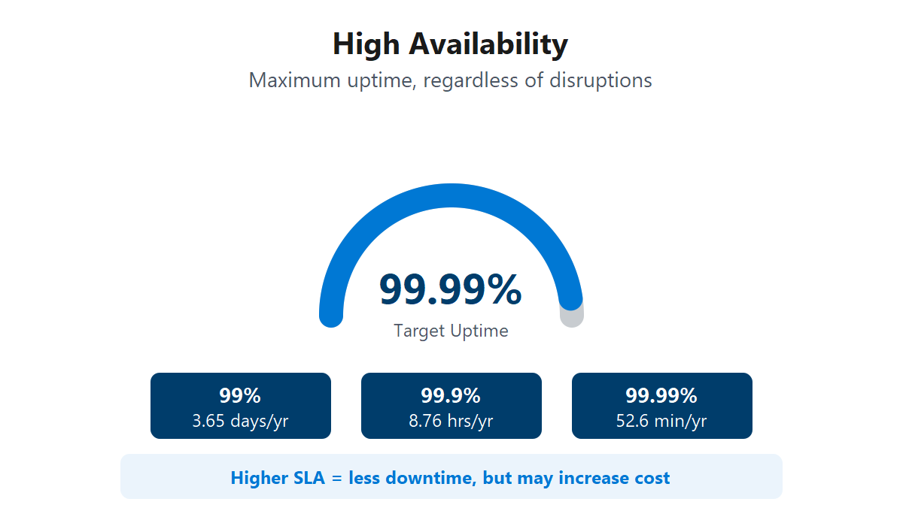

# Descripción de las ventajas de la alta disponibilidad y la escalabilidad en la nube

Al compilar o implementar una aplicación en la nube, dos de las consideraciones más importantes son el tiempo de actividad (o la disponibilidad) y la capacidad de controlar la demanda (o escala).

### Alta disponibilidad 

<figure><figcaption></figcaption></figure>

Al implementar una aplicación, un servicio o cualquier recurso de TI, es importante que los recursos estén disponibles cuando sea necesario. La alta disponibilidad se centra en garantizar la máxima disponibilidad, independientemente de las interrupciones o eventos que puedan producirse.

Al diseñar la solución, debe tener en cuenta las garantías de disponibilidad del servicio. Azure es un entorno de nube de alta disponibilidad con garantías de tiempo de actividad en función del servicio. Estas garantías forman parte de los contratos de nivel de servicio.

### Escalabilidad 

<figure><figcaption></figcaption></figure>

Otra ventaja importante de la informática en la nube es la escalabilidad de los recursos en la nube. La escalabilidad hace referencia a la capacidad de ajustar los recursos para satisfacer la demanda. Si de pronto experimenta un tráfico máximo y los sistemas están sobrecargados, la capacidad de escalar implica que puede agregar más recursos para controlar mejor la mayor demanda.

La otra ventaja de la escalabilidad es que no está pagando de más por los servicios. Dado que la nube es un modelo basado en el consumo, solo paga por lo que usa. Si la demanda baja, puede reducir los recursos y, por tanto, reducir los costos.

El escalado suele tener dos variedades: vertical y horizontal. El escalado vertical se centra en aumentar o disminuir las capacidades de los recursos. El escalado horizontal agrega o resta el número de recursos.

#### Escalado vertical 

Con el escalado vertical, si estuviera desarrollando una aplicación y necesitase más potencia de procesamiento, podría escalar verticalmente para agregar más CPU o RAM a la máquina virtual. Por el contrario, si se diese cuenta de que ha sobre-especificado las necesidades, podría escalar verticalmente hacia abajo reduciendo las especificaciones de la CPU o la RAM.

#### Escalado horizontal 

Con el escalado horizontal, si de repente experimentase un repunte brusco en la demanda, los recursos implementados se podrían ampliar (ya sea de forma automática o manual). Por ejemplo, podría agregar máquinas virtuales o contenedores adicionales. De la misma manera, si hubo una caída significativa en la demanda, los recursos implementados se podrían escalar (ya sea automáticamente o manualmente).
