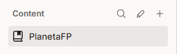

# Creación de cuenta de Gitbook

## Pasos de creación de cuenta

* Para empezar iniciamos sesión con Google o Github.
* Al momento de crear la cuenta o iniciar sesión nos pide crear nuestra primera organizacion y asignarle un nombre, en mi caso yo decidí ponerle de nombre a mi Workspace "PlanetaFP".
* Una vez creado el Workspace me diriji al apartado "content" situado en la columna principal de la izquierda y edite el nombre y el icono para personalizarlo a mi gusto.\
  
* Una vez personalizada  le di a "edit" que aparece dentro de content arriba a la derecha para empezar a documentar el proceso de la creacion de la cuenta de Gitbook.\
  \
   (1).png>)
